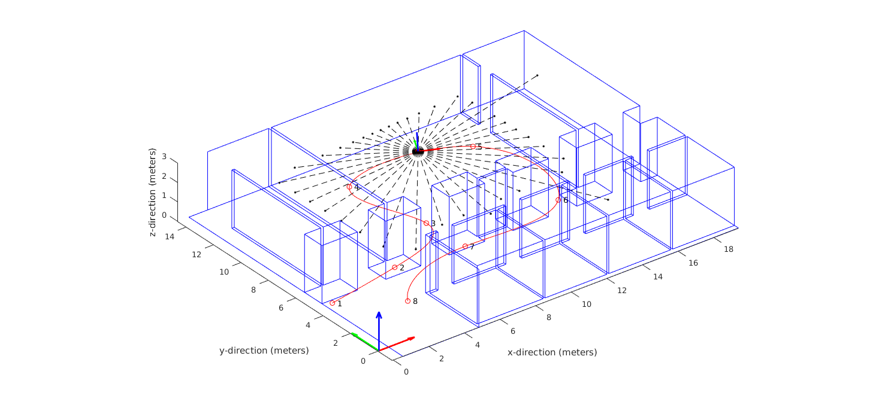
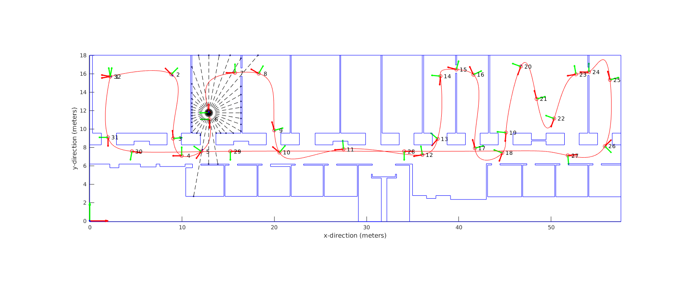

# LiDAR-Inertial 3D Plane Simulator

This repository has a LiDAR-inertial 3D plane simulator in it that allows for custom trajectory through 3D enviroments to be created, and a sensor suite to be sent through it at a given rate.
The simplest way to get started is to clone this repository into your ROS workspace, and play around with the example datasets.
Please read the guides below on how to get started, and see the ReadMe files in the package directories for more details on each package.

## Demo Video

Here is a video of a LiDAR-inertial estimator runnning on the top of this simulator.
The paper leveraging this simulator "LIPS: LiDAR-Inertial 3D Plane SLAM" will be presented at IROS 2018.

## Package Descriptions

* **lips_comm**: This package has the custom message files that the simulator should publish.
* **lips_matlab**: Contains MATLAB scripts to generate simulated LiDAR sensor moving through a 3D environment.
* **lips_simulator**: This package has a publisher node that takes the MATLAB exported files and publish on ROS.

## Example Simulations

 

## Quicker Quickstart Guide

* To get up an running using the existing datasets, please perform the following.
* Download one of the following datasets
    * Spencer Lab Large Path 01 - [download (524MB)](https://drive.google.com/file/d/1Z2DIK18WNVal9TaXaP_viYBxn8iPKZ0n/view?usp=sharing)
    * Spencer Lab Small Path 01 - [download (56MB)](https://drive.google.com/file/d/1BhNEDcnNCD0MKM4sr1uBedKvbcqbi2sC/view?usp=sharing)
    * Spencer Lab Small Path 02 - [download (13MB)](https://drive.google.com/file/d/1_jRh9c9AHg0pxAzyyFX5wJH5rcpVbhES/view?usp=sharing)
* Extract the datasets into the `/lips_matlab/output/<name_of_dataset>/`
* Launch RVIZ and load the example config in the `/lips_simulator/launch/` folder
* Launch your specific launch file to publish the simulation
    * `roslaunch lips_simulator spencer_large_01.launch`
    * `roslaunch lips_simulator spencer_small_01.launch`
    * `roslaunch lips_simulator spencer_small_02.launch`
* Examine the RVIZ output and published topics
* Edit the launch files as needed to new generated datasets or change noise properties

## Normal Quickstart Guide

* To generate your own trajectory and enviroment you can follow the followings steps.
* Open MATLAB in the matlab folder `/lips_matlab/matlab/`
* You can use an existing floorplan and path or create your own
* To create your own floorplan do the following:
    * Create a new text file in the `/lips_matlab/input/` folder
    * A floorplan is made up of pairs of points that create a line
    * `start_x, start_y, end_x, end_y`
    * This floorplan will be extruded vertically
    * Should be in the unit of `feet`
    * Use the `plot_2d_floorplan.m` script to help create
* To create your own trajectory do the following:
    * Create a new text file in the `/lips_matlab/input/` folder
    * A trajectory is made up of *ordered* 3D control points
    * `time,x(ft),y(ft),z(ft),yaw(deg),pitch(deg),roll(deg)`
    * The time isn't the real time used, but instead is a "scale" factor for how you want the spline to weight each node
    * Note that the rotations are applied as rotz(yaw)*roty(pitch)*rotx(roll)
    * Use the `plot_3d_spline.m` script to help create
* After creating your floorplan and trajectory we can specify the sensor properties
* Open the `MAINSCRIPT.m` file and edit the paths to the floorplan and trajectory files
* Specify the sensor properties you want to use in the top of the file (see matlab comments for units)
* Run the `MAINSCRIPT.m` to generate the groundtruth measurement data
* Move files from the `/lips_matlab/output/` folder to a sub-folder
* Follow the "Quicker Quickstart Guide" to publish this new simulation data on ROS

